This Genesys Cloud Developer Blueprint provides instructions for reducing call volume by deflecting voice calls from an IVR to Facebook Messenger. This solution also routes messages from Facebook Messenger to Genesys Cloud where our ACD messaging routes them to a self-service bot or agent.

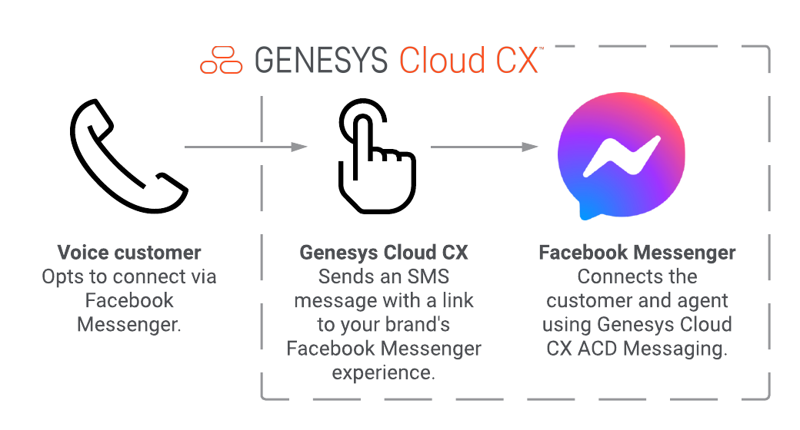

:::primary
**Tip**: There are many ways you can use call deflection to provide superior customer service by giving your customers the choice of how and when to engage with you. For example:
* Deflect calls to other digital channels, such as WhatsApp, Twitter DM, and more.
* Include a QR code in your Messenger experience to make it even easier for customers to reach you.

For more ideas, see [Suggestions for an even better experience](#suggestions-for-an-even-better-experience "Goes to the Suggestions for an even better experience section"). For technical implementation assistance, contact your Genesys Professional Services team.
:::

## Scenario

Your business wants to offer your voice-calling customers the option to connect with your support team via Facebook Messenger. By doing so, you take advantage of these benefits:

* Superior customer service (you give your customers the flexibility and convenience to message asynchronously on their schedule)
* Increased efficiency (asynchronous messaging enables your agents to handle multiple interactions simultaneously)
* Enhanced bot and auto-response options
* Ability to send images and other media attachments
* Customers retain a record of the interaction

## Solution

Your voice call flow offers calling customers the option to use Facebook Messenger. If they accept, the flow uses a Genesys Cloud data action to invoke the agentless SMS API. This API sends a text message to the customer. This text message includes a Facebook Messenger m.me URL which directs the customer to your Facebook Messenger experience.

## Contents

* [Solution components](#solution-components "Goes to the Solutions components section")
* [Prerequisites](#prerequisites "Goes to the Prerequisites section")
* [Implementation steps](#implementation-steps "Goes to the Implementation steps section")
* [Suggestions for an even better experience](#suggestions-for-an-even-better-experience "Goes to the Suggestions for an even better experience section")
* [Additional resources](#additional-resources "Goes to the Additional resources section")

## Solution components

* **Architect flow** - A flow in Architect, a drag and drop web-based design tool, dictates how Genesys Cloud handles inbound or outbound interactions. This solution provides an inbound voice call flow to allow your customers to connect directly to Facebook Messenger via a link in an SMS message. This flow uses simple TTS prompts, which you may replace with your own language, switch to another TTS engine, or replace with high-quality prerecorded prompts.
* **Data action** - Either static (preconfigured) actions or custom actions that you create to leverage the Genesys Platform API. Use these data actions to make routing decisions within your interaction flow in Architect, to present information to your agents in Scripts, or to act on data in other ways. For this solution, the data action lets your Architect call flow send an SMS message to the caller.  
* **Genesys Cloud API** - A set of RESTful APIs that enables you to extend and customize your Genesys Cloud environment. For this solution, the agentless SMS API sends the text message that includes an m.me link.
* **m.me** - A shortened URL service operated by Facebook that redirects users to a person, page, or conversation in Facebook Messenger. For this solution, your caller receives an SMS message that contains an m.me link. The caller clicks this link to connect with your agent on Facebook Messenger.

## Prerequisites

### Specialized knowledge

* Administrator-level knowledge of Genesys Cloud.
* General knowledge of Facebook.  

### Genesys Cloud account

* A Genesys Cloud 3 license. For more information, see [Genesys Cloud pricing](https://www.genesys.com/pricing "Opens the Genesys Cloud pricing page") on the Genesys website.
* (Recommended) The Master Admin role in Genesys Cloud. For more information, see [Roles and permissions overview](https://help.mypurecloud.com/?p=24360 "Opens the Roles and permissions overview article") in the Genesys Cloud Resource Center.
* ACD queues for your agents handling inbound voice and Facebook Messenger interactions. For more information, see [About interaction routing (ACD)](https://help.mypurecloud.com/?p=563 "Opens the About interaction routing (ACD) article") in the Genesys Cloud Resource Center.

### Voice and SMS numbers

* A provisioned Genesys Cloud Voice DID number. This number receives and routes voice calls to your IVR. For more information, see [Purchase DID numbers](https://help.mypurecloud.com/?p=132735 "Opens the Purchase DID numbers article") and in the Genesys Cloud Resource Center.
* A provisioned SMS number. This number serves as the "from" address for agentless SMS messages. For more information, see [Purchase SMS long code numbers](https://help.mypurecloud.com/?p=150275 "Opens the Purchase SMS long code numbers article") in the Genesys Cloud Resource Center.  

### Facebook
* A Facebook Messenger integration with Genesys Cloud. For more information, see [Configure ACD messaging for Facebook Messenger](https://help.mypurecloud.com/?p=164903 "Opens the Configure ACD messaging for Facebook Messenger article") in the Genesys Cloud Resource Center.  
* A Facebook account. For more information, see [Creating an Account](https://www.facebook.com/help/570785306433644 "Goes to the Creating an Account page") in the Facebook documentation.
* A Facebook page with the Messaging button enabled. For more information, see [How do I create a Facebook Page](https://www.facebook.com/help/104002523024878 "Goes to the How do I create a Facebook Page page") in the Facebook documentation.

## Implementation steps

* [Create a role for handling agentless SMS notifications](#create-a-role-for-handling-agentless-sms-notifications "Goes to the Create a role for handling agentless SMS notifications section")
* [Create an OAuth client with the new role](#create-an-oauth-client-with-the-new-role "Goes to the Create an OAuth client with the new role section")
* [Add the data action integration](#add-the-data-action-integration "Goes to the Add the data action integration section")
* [Import and test the data action](#import-and-test-the-data-action "Goes to the Import and test the data action section")
* [Create and test your Facebook Messenger m.me link](#create-and-test-your-facebook-messenger-m.me-link "Goes to the Create and test your Facebook Messenger m.me link section")
* [Import the call flow](#import-and-update-the-call-flow "Goes to the Import and update the call flow section")
* [Update the call flow](#update-the-call-flow "Goes to the Update the call flow section")
* [Route your inbound phone number to the call flow](#route-your-inbound-phone-number-to-the-call-flow "Goes to the Route your inbound phone number to the call flow section")
* [Test your solution](#test-your-solution "Goes to the Test your solution section")

### Create a role for handling agentless SMS notifications

1. Log in to your Genesys Cloud organization and create a role called **Agentless SMS Notification**.  
2. Assign the **Conversation:message:Create** permission to the **Agentless SMS Notification** role.
3. Assign the **Agentless SMS Notification** role to your user account.

4. To verify that your new permission is applied correctly, log out and then log back in to Genesys Cloud.

  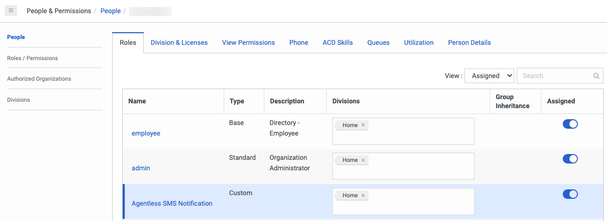  

For more information, see these articles in the Genesys Cloud Resource Center:
* [Work with roles and permissions](https://help.mypurecloud.com/?p=56682 "Opens the Work with roles and permissions article")
* [Edit user configuration data](https://help.mypurecloud.com/?p=59063 "Opens the Edit user configuration data article in the Genesys Cloud Resource Center")

### Create an OAuth client with the new role

1. Create an OAuth client with the following values:

    * **App name**: Data Action - Agentless SMS Notification
    * **Grant type**: Client credentials

2. Assign the new role:

    i. Go to the **Roles** tab.

    ii. Next to **Agentless SMS Notification** select the **Assigned** toggle.

3. Copy the client ID and client secret values and paste them in a text file for use when you add the data action integration.

  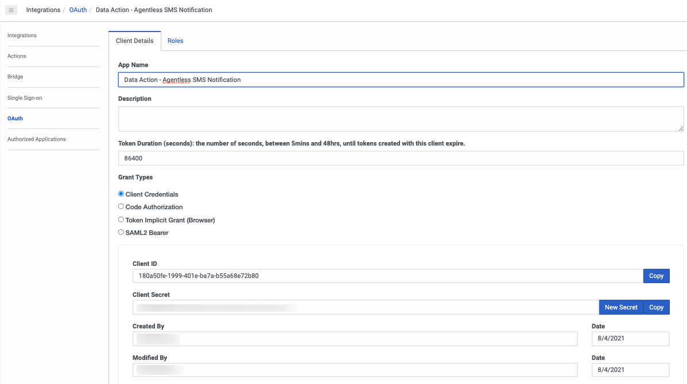  

For more information, see [Create an OAuth client](https://help.mypurecloud.com/?p=188023 "Opens the Create an OAuth client article") in the Genesys Cloud Resource Center:

### Add the data action integration

1. Add a Genesys Cloud Data Actions integration with the following values:

    * **Integration Name**: Send Agentless SMS Notification

2. Configure the client ID and client secret values.

    i. On the **Configuration** tab, click **Credentials**.

    ii. Paste the values that you copied earlier.

    iii. Click **Save**.  

3. Activate the integration.  

  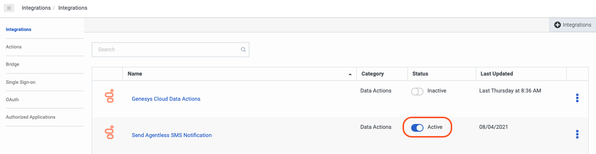  

For more information, see [Add an integration](https://help.mypurecloud.com/?p=135807 "Opens the Adds an integration article") in the Genesys Cloud Resource Center.

### Import and test the data action

1. Go to the [facebook-ivr-deflection-blueprint repository](https://github.com/MyPureCloud/facebook-ivr-deflection-blueprint "Opens the facebook-ivr-deflection-blueprint GitHub repository") in GitHub and download the files.
2. Import the data action file.

  i. In **Integrations** > **Actions**, search for and select the Send Agentless SMS Notification file.

  ii. Click **Import Action**.

3. Click **Setup** and then **Test**. Specify the following values:

    * **from**: a complete e164-formatted SMS number that is provisioned in your org. For example,`+13175555555`.
    *  **to** field: a complete e164-formatted destination SMS number that you can use to receive test SMS messages. For example, `+12015555555`.
    * **Body**: a test message. For example, `Hello there`.

4. Click **Run Action**.
5. Verify that the output is successful and that you receive the message at the destination SMS number. If any error occurs, verify your [OAuth client]((#configure-an-oauth-client-for-the-data-action "Goes to the Configure and OAuth client for the data action section") and [integration]((#add-the-data-action-integration "Goes to the Add the data action integration section") credentials.
6. When everything works as expected, click **Save & Publish**.

  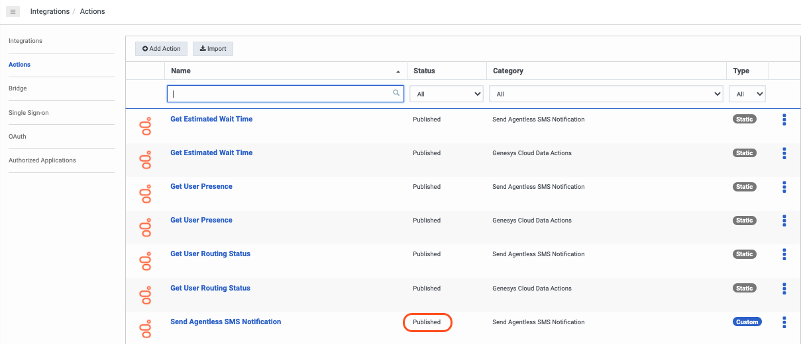  

For more information, see [Manage actions for integrations](https://help.mypurecloud.com/?p=141950 "Opens the Manage actions for integrations article") in the Genesys Cloud Resource Center.

### Create and test your Facebook Messenger m.me link

1. Create your m.me URL in either of these formats:

  * http://m.me/<PAGE_USERNAME>
  * http://m.me/<PAGE_ID>

2. To test your Facebook Messenger m.me link, send it in a text message to a friend. When your friend taps the link, your friend should see Facebook Messenger open for your Facebook page on their mobile device.

For information on how to create a user name for your Facebook page, see [How do I create a username for my Facebook Page?](https://www.facebook.com/help/121237621291199/ "Goes to the How do I create a username for my Facebook Page page in the Facebook documentation")

:::primary
**Important**
Messages sent to your Facebook page via Facebook Messenger should be routed to your Genesys Cloud org.
:::

For more information about integrating Facebook Messenger with Genesys Cloud, see [Configure ACD messaging for Facebook Messenger](https://help.mypurecloud.com/?p=164903 "Goes to the Configure ACD messaging for Facebook Messenger article") in the Genesys Cloud Resource Center.

### Import the call flow

1. In Architect, add a new inbound call flow with these values:

    * **Name** - Call Deflection to Facebook Messenger
    * **Description** - Offer voice calling customers an option to continue the conversation with Facebook Messenger

2. Import the `Call Deflection to Facebook Messenger.i3InboundFlow` flow, which is included in the Github repository for this blueprint.

  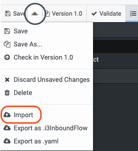  

For more information about how to import a flow, see [Import or export a flow](https://help.mypurecloud.com/?p=2730 "Goes to the Import or export a flow article") in the Genesys Cloud Resource Center.

### Update the call flow

1. Click the **Set Flow Parameters** starting task.
2. For the **Flow.ACD_Voice_Queue variable**, select the queue that your voice agents use.
3. For the **Flow.From_SMS_Phone_Number** variable, specify an SMS number that is available in your **Admin** > **Message** > **SMS Number Inventory**. Be sure to specify the country code and number.
4. Update the **Flow.FBM_Mme_URL** variable with the m.me link to your Facebook Messenger experience.
5. Optionally update the **Flow.FBM_SMS_Message** variable with your preferred wording.

  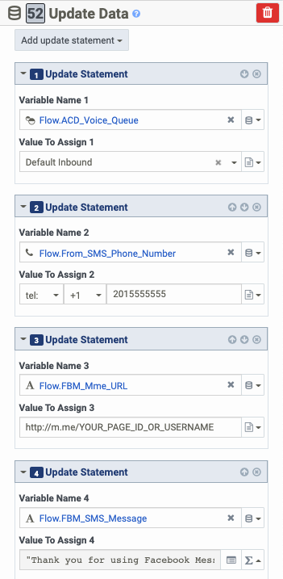  

6. Click the **Send FBM Invitation SMS** reusable task.

  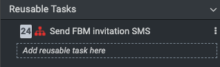

7. In the flow, click the **Data Action: Send SMS** call data action.

  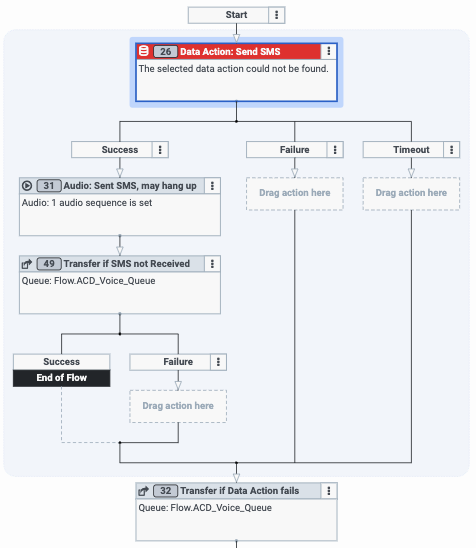

8. Under **Category**, select **Send Agentless SMS Notification**.
9. Under **Data Action**, select **Send Agentless SMS Notification**.
10. Under **Inputs**, verify the following input settings. **Note**: All three inputs are expressions:  

    * **from**: Flow.From_SMS_Phone_Number.e164
    * **to**: Flow.To_SMS_Phone_Number.e164
    * **body**: Flow.FBM_SMS_Message

  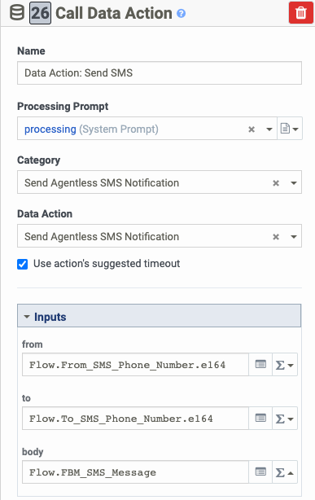

11. Click **Validate**.
12. Click **Publish** to make the flow available for routing.

### Route your inbound phone number to the call flow

After your flow is published, you must associate it with an inbound DID number. Inbound voice calls will route to the new Facebook Messenger flow experience, giving customers the opportunity to switch from voice to messaging.

1. In the Admin menu, click **Routing** > **Call Routing**.
2. Click **Add Call Route**.
3. Either add a new call route or edit an existing route.

  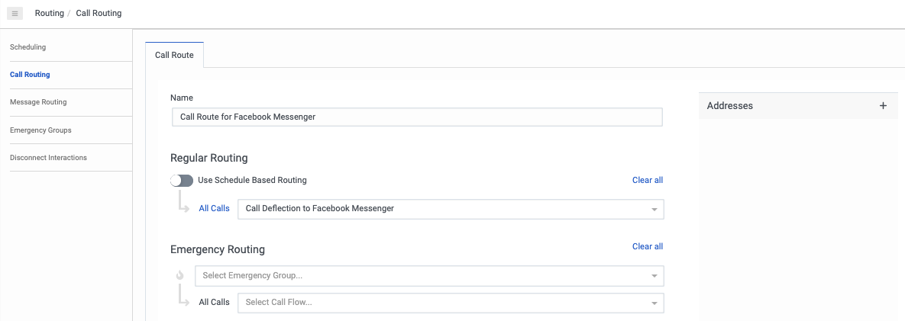

For more information on call routing and schedule-based routing, see [Call routing overview](https://help.mypurecloud.com/?p=151030 "Goes to the Call routing overview article") in the Genesys Cloud Resource Center.

### Test your solution

1. Call your inbound DID number from your mobile phone and ensure that you are routed to your Facebook Messenger Call deflection flow.
2. Navigate your IVR menu and opt to switch to Facebook Messenger.
3. Confirm your mobile phone number.
4. When you receive the SMS message, tap the Facebook Messenger m.me link and ensure that you are directed to your Messenger experience.
5. Send a message via Facebook Messenger to your Facebook page. Ensure that the interaction is routed to your ACD queue where agents handle Facebook Messenger interactions.
6. Continue your interaction with Facebook Messenger!

## Suggestions for an even better experience

There are many ways to use call deflection to improve customer experience. For example:
* Promote Facebook Messenger proactively by adding your m.me link to your website and email signatures.
* Create a [QR code](https://www.qrcode-monkey.com/ "Goes to the QR Code Monkey site") for your m.me link so your customers can scan it.
    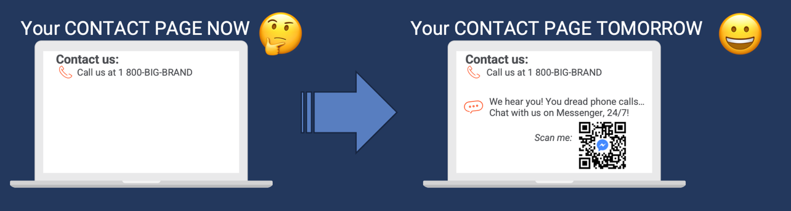

To report on the effectiveness of your deflection to Facebook Messenger, improve your use of flow outcomes in your inbound call flow:
  * Add a **Deflected to Facebook Messenger** flow outcome to Genesys Cloud. For more information, see [Add a flow outcome](https://help.mypurecloud.com/?p=185383 "Goes to the Add a flow outcome article") in the Genesys Cloud Resource Center.
  * Set the Flow Outcome action in your inbound call flow after you have sent the SMS with the m.me link. For more information, see [Set Flow Outcome action](https://help.mypurecloud.com/?p=185391 "Goes to the Set Flow Outcome action article") in the Genesys Cloud Resource Center.

Finally, consider the following refinements to improve the quality and maintainability of your call deflection experience:   
* Replace TTS with professionally recorded prompts.
* Move the parameters (such as your From: SMS number and M.me link) to a data table in Genesys Cloud to simplify administration.

## Additional resources

* [Using m.me Links](https://developers.facebook.com/docs/messenger-platform/discovery/m-me-links/ "Goes to the Using m.me Links article") in the Facebook developer documentation
* The [facebook-ivr-deflection repository in Github](https://github.com/GenesysCloudBlueprints/facebook-ivr-deflection-blueprint "Opens the facebook-ivr-deflection-blueprint") repository in GitHub
